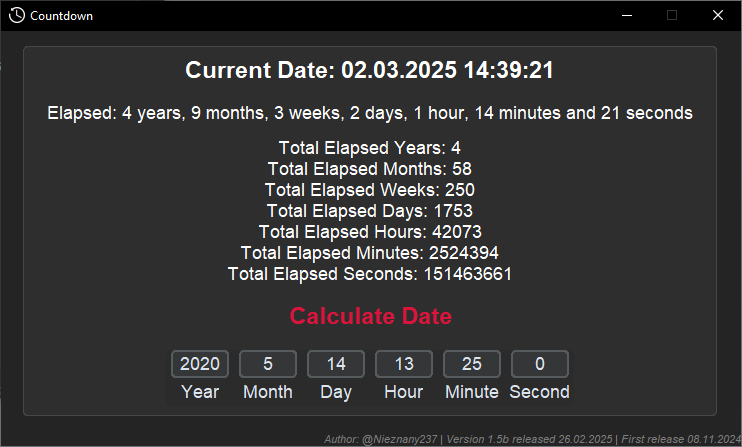
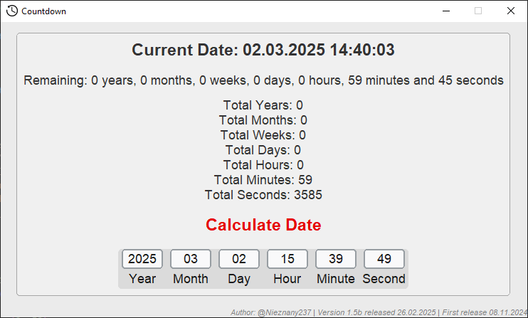
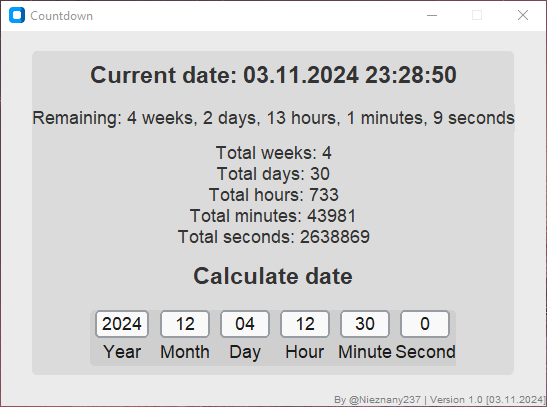
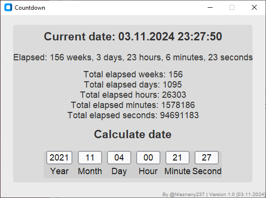
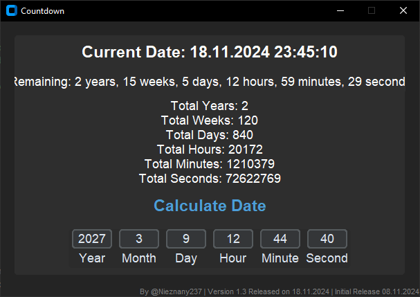

## Version: 1.3

# CustomTkinter-Countdown

A simple countdown timer application built with Python 3.11 and CustomTkinter. This application allows users to set a target date and time, displaying the remaining or elapsed time in various formats.

## Examples

Here are two examples of how the application looks:

## Old images

