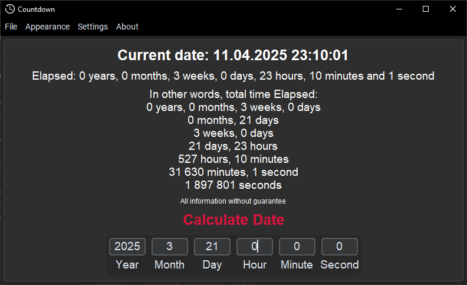
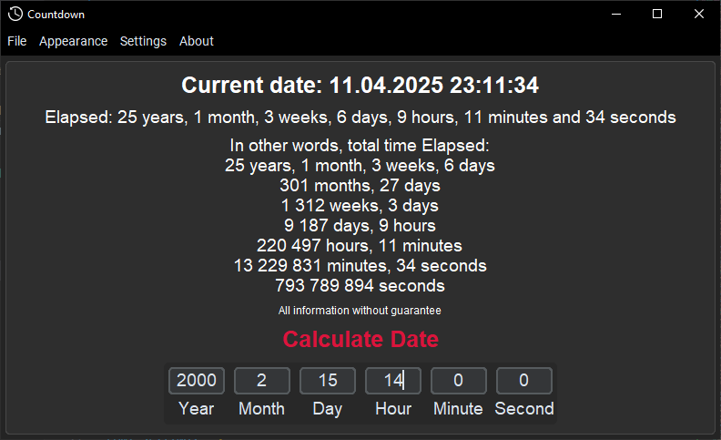
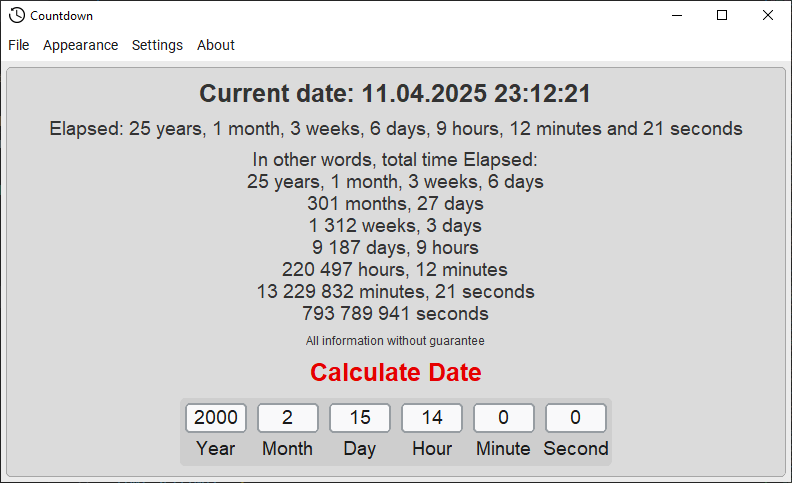
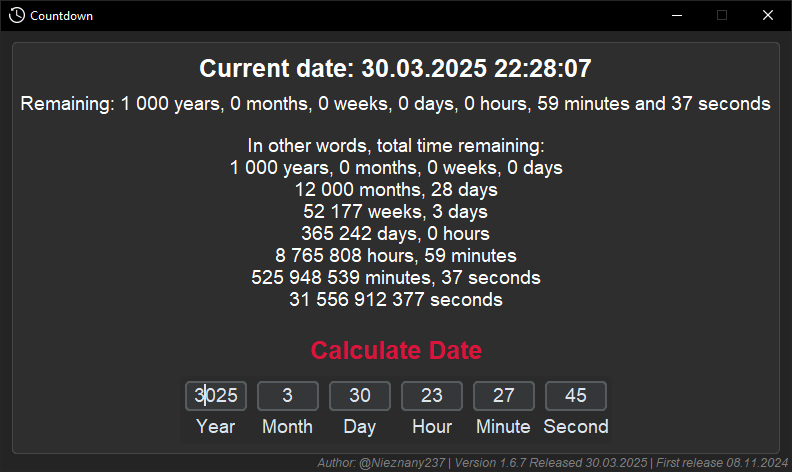
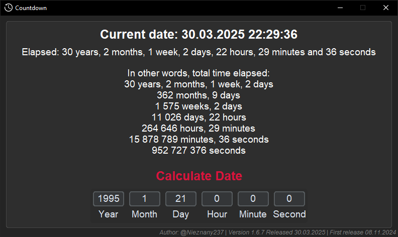
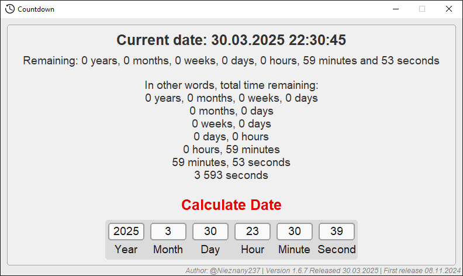

## Version: 1.6.9 [13.04.2025]

# CustomTkinter-Countdown

A versatile time calculator built with Python 3.13 and CustomTkinter that handles both:
-  **Remaining time**: Calculate remaining time until future events (deadlines, birthdays, holidays)
-  **Elapsed time**: Track duration since past events (anniversaries, milestones, project starts)

## Required Libraries

[comment]: <> (https://www.tablesgenerator.com/markdown_tables#)
| Library                                                         | Purpose                    | Installation                  |
|-----------------------------------------------------------------|----------------------------|-------------------------------|
| [CustomTkinter](https://github.com/TomSchimansky/CustomTkinter) | Modern UI components       | `pip install customtkinter`   |
| [Pillow](https://pypi.org/project/pillow/)                      | Image handling             | `pip install pillow`          |
| [python-dateutil](https://dateutil.readthedocs.io/)             | Advanced date calculations | `pip install python-dateutil` |
| [CTkMenuBar](https://github.com/Akascape/CTkMenuBar)            | Modern MenuBar             | `pip install CTkMenuBar`      |

## Examples

Here are examples of how the application looks:

## Old images from previous versions

